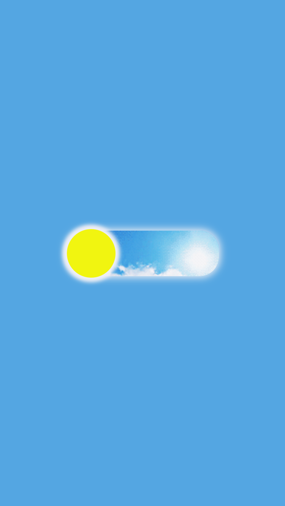
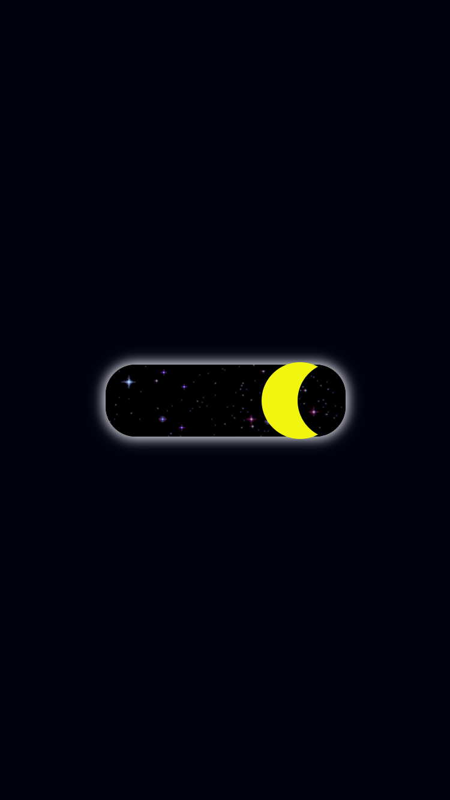

# Dark Mode
<p align="center">Projeto desenvolvido para estudo de manipulação do DOM.
</p>
<h4 align="center"> Status do projeto: Concluído.</h4>

### Tabela de conteudo

<p align="center">
<a href="#funcionalidades">funcionalidades</a> • 
<a href="#Demostração-da-Aplicação">Demostração</a> • 
<a href="#Como-executar-o-projeto">como Executar</a> • 
<a href="#Tecnologias-utilizadas">Tecnologias</a> •   
<a href="#autor">Autor</a> •
<a href="#licenc-a">Licença</a> 
</p>

### funcionalidades

- [x] Disparar o evento de click
- [x] Mudar o background do body e do botão.

### Demostração da Aplicação
* Clicar no botão;
* Mudança de background.
 

### Como executar o projeto

Antes de começar, você vai precisar ter instalado em sua máquina as seguintes ferramentas:

Além disto é bom ter um editor para trabalhar com o código como [VSCode](https://code.visualstudio.com/)

```bash
# Clone este repositório
$ git clone <>

# Acesse a pasta do projeto no terminal/cmd
$ cd ...

# Execute a aplicação 
$ index.html ou server live(plugin do vscode)
```
            

### Tecnologias utilizadas

* HTML
* CSS
* JavaScript

### Autor
Feito com ❤️ por Laihanne Campelo 👋🏽 Entre em contato!

email: laihanne.campelo@gmail.com

### Licença
MIT License